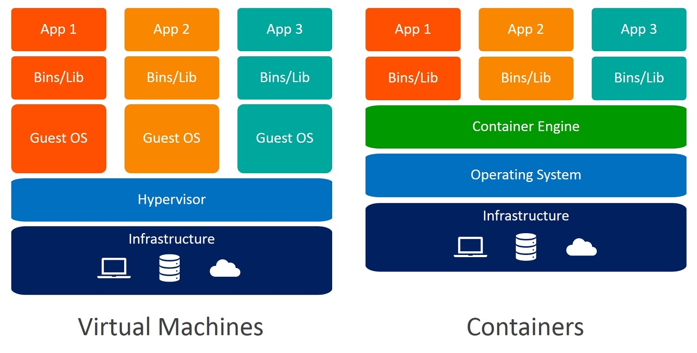
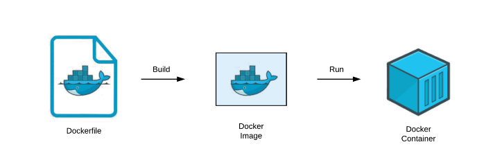
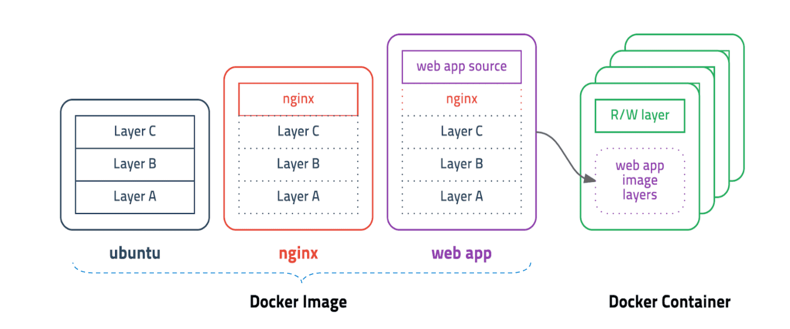

# 도커

Docker라는 기술을 사용하여 어플리케이션을 관리한다면 `언제 어디서든 항상 동일한 환경`에서 작업을 진행을 할 수 있습니다.

예를 들어서 node가 설치가 되지않은 작업환경이 있습니다. node가 설치되지 않으면 프론트, 서버 작업을 할 수 없을 것이지만 docker를 이용한다면 어플리케이션의 node 버전을 docker hub에서 다운 받아서 진행을 할 수 있습니다. 

 

### 1) 도커 컨테이너

우리는 컨테이너라고 하면 바로 생각이 나는것은 해외 수입 수출을 하기위해서 `담아 두는 상자`가 바로 떠오를 것이다.

docker에서 사용하는 이 컨테이너 라는 단어의 의미도 크게 다르지 않다고 생각합니다.

도커에서 컨테이너라는 기술은 `독립된 환경에서 프로세스가 동작하는 기술`이라고 합니다. 이 기술은 `동일한 작업환경이 아닌` 환경에서 유용하게 이용이 됩니다. 작업이 동일하다면 상관이 없겠지만 다를 경우에는 해결 방법은 컴퓨터 구매, VM, Doker가 있겠습니다.

새로운 환경을 구축하기 위해서 컴퓨터를 새로산다면 금전적문제가 생길겁니다. 그렇다면 VM 이나 Doker를 이용한다면 어느쪽이 효율적인지 비교한 자료들을 가져와보았습니다.

 

 

VM은 하이퍼바이저를 통해 Guest OS를 가상화를 시켜 애플리케이션을 실행하면 인터페이스 측면에서는 쉽고 간단하지만 애플리케이션을 관리하기에는 메모리적으로 많이 소비를 하기 때문에 사용하기에는 부적절하다.

Container는 프로세스를 격리하는 기술로 격리한 프로세스만큼만 메모리가 적용이 되기 때문에 손실이 없다.

### 2) 도커 이미지

윈도우를 설치하기위해서 이미지 파일을 이용을 많이 했을 것입니다. 이 이미지 파일을 이용하여 설치를 한다면 윈도우를 실행하기 위한 파일 및 데이터들이 설치가 되면서 윈도우를 이용할 수 있게 됩니다.

도커 이미지도 윈도우 이미지와 크게 다를 것이 없습니다. `컨테이너를 사용하기 위한 파일 및 값이 포함` 이 되어있는 것이 도커 이미지이다.  그렇기 때문에 도커 이미지의 용량은 x00Mbyte가 됩니다.

도커 이미지는 애플리케이션의 모든 정보를 가지고 있다. 그렇다면 애플리케이션의 정보가 수정이 되었다면 x00Mbyte 이미지를 다시 다운 받아서 실행해야 할까??

그렇지 않다. 이 문제를 해결하기 위해서 `layer` 라는 개념의 이름으로 `유니온 파일 시스템`을 이용한다.

#### UFS - 유니온 파일 시스템

- 여러 파일 시스템을 하나의 파일 시스템으로 마운트 마운트 하는 기술이라고 합니다.

- UFS 유니온 파일 시스템을 이용하여 여러개의 레이어를 하나의 이미지로 사용할 수 있게 해준다.

기본 ubuntu 베이스 이미지를 다운 받은 상태이다. 그리고 nginx의 이미지를 다운 받으려고 하는데 ubuntu 기반으로 작성 되었고 nginx의 레이어만 추가된 이미지 파일이다. 그렇다면 nginx 레이어만 다운 받으면 되기 떄문에 효율적으로 관리를 할 수 있습니다.

